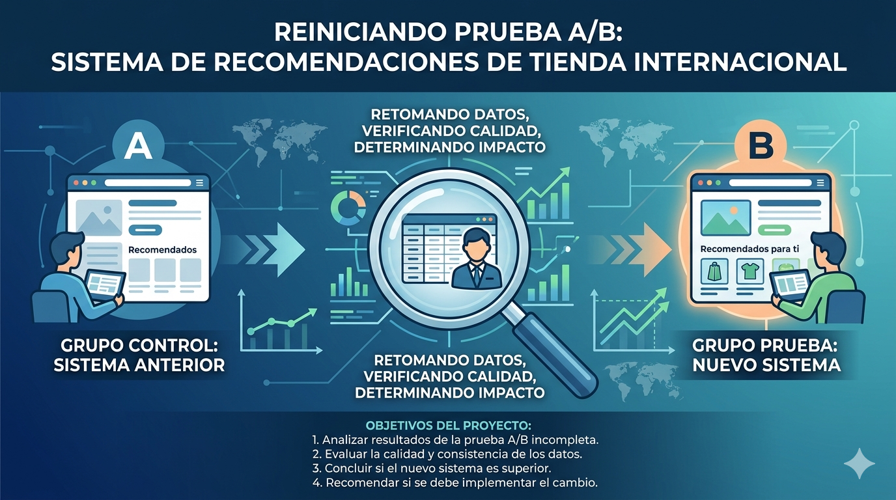

  

<h1 align="center">🧪 A/B Test: Sistema de Recomendaciones</h1>

  
  
  
  

---

Una tienda en línea internacional lanzó una prueba A/B para evaluar un nuevo sistema de recomendaciones. El equipo que la inició no logró completarla. Este proyecto retoma los datos, verifica la calidad del experimento y determina si el cambio debe implementarse.

---

## 🎯 Objetivo

Evaluar si el nuevo embudo de pago con sistema de recomendaciones mejorado aumenta en al menos un **10% la conversión** en cada etapa del embudo `product_page → product_cart → purchase` dentro de los 14 días posteriores al registro.

---

## 📋 Especificación Técnica

| Parámetro | Detalle |
|-----------|---------|
| Nombre del test | `recommender_system_test` |
| Grupo A | Control (embudo original) |
| Grupo B | Tratamiento (nuevo sistema de recomendaciones) |
| Inicio | 7 de diciembre de 2020 |
| Cierre de inscripción | 21 de diciembre de 2020 |
| Fin | 1 de enero de 2021 |
| Audiencia objetivo | 15% de nuevos usuarios de la región UE |
| Participantes previstos | 6.000 |

---

## 📊 Dataset

Cuatro archivos con datos del experimento:

- `ab_project_marketing_events_us.csv`: calendario de eventos de marketing 2020.
- `final_ab_new_users_upd_us.csv`: usuarios registrados entre el 7 y 21 de diciembre de 2020.
- `final_ab_events_upd_us.csv`: eventos de los nuevos usuarios (7 dic 2020 – 1 ene 2021).
- `final_ab_participants_upd_us.csv`: asignación de usuarios a grupos de prueba.

> Nota: Datos simulados para fines educativos (Practicum / TripleTen).

---

## 🧩 Planificación y Ejecución del Proyecto

Metodología: Carga de datos → Limpieza → EDA → Análisis del embudo → Validación estadística → Conclusiones.

Flujo: **Verificación del diseño → EDA → Prueba Z → Correcciones (región, comparaciones múltiples) → Decisión**

📓 Notebooks:
- [Notebook: Análisis completo Test A/B](notebooks/Test_AB.ipynb)

---

## 🔍 Hallazgos clave del EDA

1. **Muestra insuficiente**: solo se alcanzó el **61% del objetivo** (3.675 de 6.000 participantes), representando apenas el 7,7% de nuevos usuarios UE (vs. el 15% requerido).
2. **Anomalía en tracking**: el **19,4% de los compradores** no registró el evento `product_cart`, lo que invalida el análisis paso a paso del embudo.
3. **Desbalance regional**: diferencia significativa en la composición regional entre grupos (p = 0,044), lo que introdujo sesgo en los resultados crudos.
4. **Contaminación por campaña**: la campaña navideña (25 dic – 3 ene) coincidió con el tramo final de la prueba, reduciendo el volumen de datos utilizable.
5. **446 usuarios (12,1%)** participaban simultáneamente en otras pruebas A/B.

---

## 📈 Resultados de conversión

| Métrica | Grupo A | Grupo B | Lift | P‑valor ajustado | ¿Significativo? |
|---------|---------|---------|------|-------------------|-----------------|
| Product Page | 64,86% | 56,77% | −12,47% | 0,0002 | ✅ Sí (A > B) |
| Product Cart | 30,06% | 27,71% | −7,81% | 0,2040 | ❌ No |
| Purchase | 31,92% | 28,08% | −12,02% | 0,1218 | ❌ No |
| ARPU | $20,88 | $15,76 | −24,53% | 0,1218 | ❌ No |

> P‑valores ajustados por corrección Holm‑Bonferroni y análisis Mantel‑Haenszel por región.

---

## ⚠️ Limitaciones críticas

- **Poder estadístico**: solo 0,05% para detectar el lift esperado en `purchase` (mínimo recomendado: 80%).
- **Cuota de audiencia incumplida**: 7,7% alcanzado vs. 15% requerido.
- **Desbalance regional** que afecta los resultados crudos.
- **Datos de embudo no fiables** por la anomalía en `product_cart`.

---

## 💡 Recomendaciones

- **No implementar** el nuevo sistema de recomendaciones con base en esta prueba.
- Repetir el experimento con un diseño mejorado:
  - Calcular el tamaño muestral a priori (mínimo 6.000, idealmente más).
  - Estratificar la asignación por región para evitar desbalances.
  - Monitorear la cuota de audiencia (15% UE) en tiempo real.
  - Validar el tracking de eventos (`product_cart`) antes del lanzamiento.
  - Planificar el período fuera de temporada festiva.

---

## 🧰 Tecnologías Utilizadas

---

## 👩‍💻 Autor

**Carolina Rodríguez Guerra**
