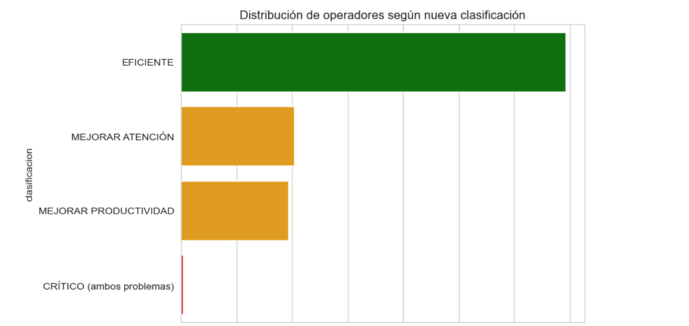
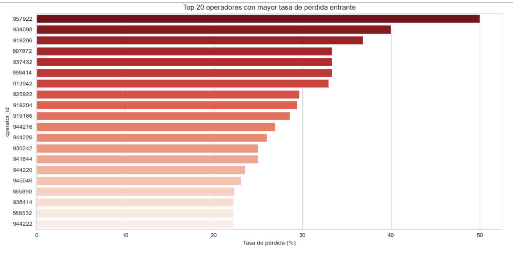

  
  

<h1 align="center">📞 Telecom Analytics: Identificación de Operadores Ineficientes</h1>

    
  
  

---

**CallMeMaybe** (telefonía virtual) necesitaba detectar operadores con bajo desempeño para reducir llamadas perdidas y tiempos de espera.

---

## 🎯 Objetivo
Identificar operadores ineficientes mediante métricas operativas (tasa de pérdida, tiempo de espera, volumen saliente) y proponer mejoras.

---

## 📊 Dataset
Dos tablas simuladas con **1.092 operadores** y **50k+ registros**:
- `telecom_dataset_us.csv`: llamadas (entrantes/salientes/internas), duración, llamadas perdidas, operador.
- `telecom_clients_us.csv`: clientes, plan tarifario, fecha registro.

> Nota: Datos simulados para fines educativos.
---

## 🧩 Planificación y Ejecución del Proyecto
Metodología: Limpieza → EDA → Ingeniería de variables → KPIs → Validación estadística.  
Flujo: **EDA → Hipótesis → Validación → Insights**  
📓 Notebooks: [`01_task_breakdown.ipynb`](../notebooks/01_task_breakdown.ipynb) · [`02_implementation.ipynb`](/notebooks/02_implementation.ipynb)

---

## 🔍 Hallazgos clave
1. **El problema principal no es la atención entrante** (tasa pérdida media <2%), sino la **baja productividad saliente** (18% de operadores hacen <11 llamadas out en todo el período).
2. **19% de operadores** tienen alta tasa de pérdida (>10%) o alto tiempo de espera (>60s).  
3. Solo **3 casos críticos** combinan mala atención y baja productividad.

---

## 📈 Clasificación final

  

| Tipo | % |
|------|---|
| Eficiente | 63% |
| Mejorar atención | 19% |
| Mejorar productividad | 18% |
| Crítico | <1% |

## 🔍 Top 20 operadores con mayor tasa de pérdida (atención prioritaria)

  

---

## 💡 Recomendaciones
- Capacitación en gestión de espera para el 19% con problemas de atención.
- Metas semanales de llamadas salientes para el 18% con baja productividad.
- Intervención personalizada para los 3 casos críticos.

---

## 🧰 Tecnologías Utilizadas

---

## 👩‍💻 Autor
**Carolina Rodríguez Guerra** 

